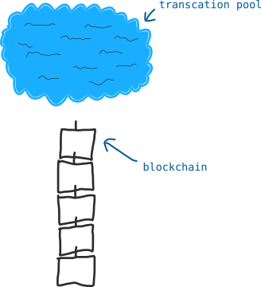
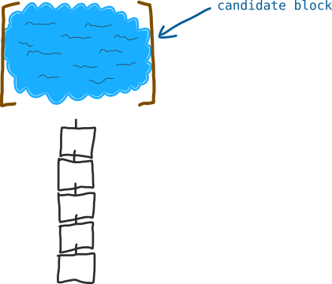
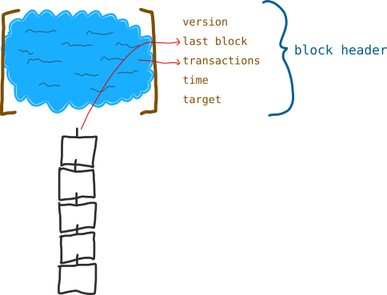
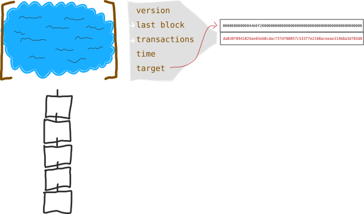
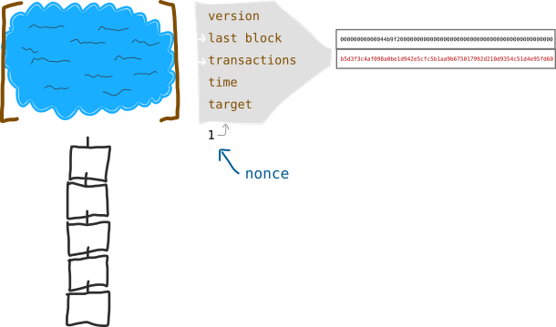
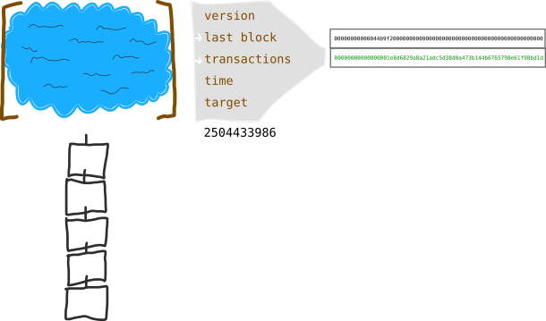
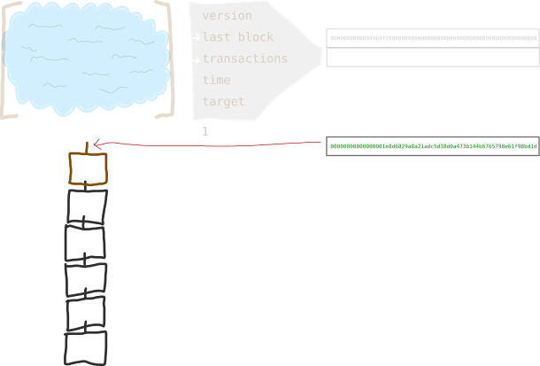

## Block là gì?

Block là một nhóm các transaction được gom lại với nhau để add vào blockchain.

# Block được tạo thành như thế nào?

Block được tạo bởi các miner

Khi bạn tạo ra một transaction thì nó sẽ không được add thẳng vào blockchain mà nó được giữ lại trong Transaction Pool hay còn gọi là Memory Pool

Nếu bạn là một miner thì công việc của bạn sẽ là các transactions từ memory pool vào một Block gọi là "candidate block" ( tức là ứng cử viên để xem xét có đưa vào Blockchain hay không ). Tiếp sau đó miner sẽ ra sức đẩy "candidate block" này vào trong blockchain.

# Block Header

Mỗi một canidate block sẽ có một Block Header chứ các thông tin Metadata để mô tả về block đó

Miner sẽ sử dụng Metadata này khi cố gắng đưa block này vào trong blockchain

> Metadata là thông tin về thông tin, nó là những dữ liệu mô tả về những dữ liêu khác và đóng vai trò như một nhãn thông tin.

# Các trường dữ liệu trong Block Header

Chúng ta sẽ không đi sâu vào chi tiết dữ liệu của từng trường ngay bây giờ nhưng chúng ta có thể ngó nhanh qua để nắm được tổng thể.

**Version**

* Mô tả cấu trúc của data bên trong block. Được sử dụng để máy tính có thể đọc nội dung của mỗi block một cách chính xác.

**Last Block**

* Một con số nhận dạng ( identification number ) về block trước.  Và tất nhiên chúng ta cũng sẽ cố gắng để tính ra được 1 con số tương tự cho Candidate Block hiện tại, có cái số ID này tức là nó đã được add vào blockchain

**Merkle Root**

* Tất cả các transactions sẽ được băm ( hash ) với nhau để tạo thành một chuỗi văn bản, nhưng đây có thể coi là phần quan trọng nhất của Block Header

**Time**

* Thời điểm hiện tại

**Target**

* Giá trị mà miner cần phải tìm để đẩy candidate block vào trong blockchain. Nó được set ( chỉ định ) bởi Bitcoin Network và nó chỉ có ý nghĩa mang tính thời điểm.

# Làm thế nào để các blocks được add vào blockchain?

Để đưa candidate block vào blockchain thì bạn phải hash data trong Block Header và hy vọng kết quả sau khi hash có giá trị nhỏ hơn giá trị của Target.

Target lại được tính toán từ Difficulty. Một giá trị được chỉ định bởi Bitcoin Network để điều chỉnh mức độ khó khi add thêm một block mới vào blockchain.

Hãy hình dung giá trị Target giống như một cái mốc đối với candidate block,  độ khó càng tăng ( Difficulty giá trị lớn ) thì giá trị của Target càng giảm vì càng khó để tìm ra một hàm băm cho ra kết quả hash nằm dưới giá trị Target.

Có thể bạn đang cảm thấy lúng túng khi phải phân biệt giữa Target và Difficulty. Cứ từ từ rồi khoai sẽ nhừ, chúng sẽ được dần dần làm sáng tỏ.

> Difficulty là một giá trị mà mạng bitcoin network đặt ra để điều chỉnh mức độ nhanh hay chậm mà một block mới được tìm thấy để add vào blockchain. Sau mỗi khoảng 2016 blocks được add vào blockchain thì giá trị của Difficulty lại được điều chỉnh ( thay đổi ) để đảm bảo rằng cứ trung bình 10 phút sẽ có một block mới được thêm  vào blockchain

# Con số Nonce

Có lẽ có một điều thiếu sót còn chưa được đề cập ở đầu bài. Thực ra thì chúng ta sẽ không chỉ hash mỗi Block Header mà nó được hash cùng với một con số nữa đi kèm ( extra number ).

Con số đó được gọi là Nonce. Nó chỉ là một con số tùy ý dùng để hash cùng với Block Header để đảm bảo là giá trị hash của block sẽ nằm dưới giá trị của Target.

Nonce: *number used once*. Một con số dùng tùy ý được sử dụng một lần duy nhất trong giao tiếp mã hóa ( cryptographic communication )

Nếu số Nonce đầu tiên không xài được ( thường bắt đầu từ số 0 ) thì hãy tăng nó lên và tiếp tục hash cùng với Block Header. Cuối cùng bạn sẽ tìm thấy một số Nonce mà kết quả hash của nó với Block Header là một giá trị nhỏ hơn giá trị của Target.

> Có thể bạn sẽ thắc mắc giá trị hash có chứa ký tự chữ chứ không chỉ là số vậy thì lớn hơn hay nhỏ hơn có ý nghĩa thế nào?  Thực ra thì bạn hãy nghĩ đó là giá trị số nhưng đó là các số dạng thập lục phân ( hexadecimal ), loại số mà máy tính khoái làm việc với nó hơn là chúng ta vốn quen với hệ thập phân

# Chúc mừng

Khi bạn tìm thấy số Nonce cần thiết, bạn đã vượt qua được thử thách mà Bitcoin Network đưa ra cho bạn và tất nhiên candidate block của bạn sẽ trở thành 1 block mới trong chuỗi các block nằm trong file blockchain, hay nói theo một cách khác bạn đã đào được một block. Nhưng mà nói theo logic hình ảnh thì có vẻ đào là lấy từ lòng đất đem ra còn đây giống như đem chôn, mình có sẵn 1 cục vàng ( block ) rồi mình đem chôn xuống đất ( blockchain ) để lưu trữ lâu dài. Nhưng thôi kệ bọn Tây nó dùng từ đào thì ta cứ theo nó thôi. Ai bảo bọn nó giàu thì nó sẽ thành chuẩn thôi, cái này phải chấp nhận.

Bây giờ tất cả các miner lại quay trở lại transaction pool và tiếp tục là việc với candidate block tiếp theo. Và các miner này lại tiếp tục dùng kết quả hash của block vừa đưa vào chain thành công để làm đầu vào cho Block Header mới để bắt đầu quá trình hash, mọi thứ lại được lặp lại.

Chúc may mắn
