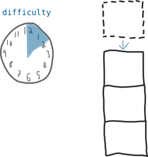
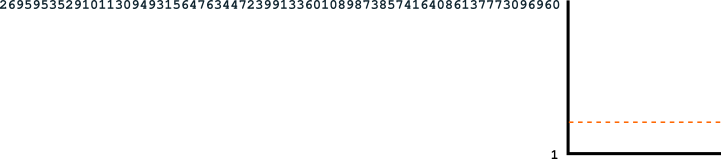

# Difficulty

Cơ chế để điều chỉnh thời gian cần để đào được một block mới.

# Difficulty ( độ khó ) là cái gì?

Difficulty là một con số để điều chỉnh bao lâu thì một miner có thể thêm được block vào blockchain

Giá trị của Difficulty được update 2 tuần một để đảm bảo cứ trung bình 10 phút thì một block mới sẽ được đưa vào blockchain

# Tại sao Difficulty lại quan trọng?

> Bởi vì nó đảm bảo rằng các block sẽ được add vào blockchain một cách định kỳ kẻ cả là khi có thêm nhiều miner tham gia vào trong bitcoin network.

Nếu độ khó là một hằng số nó sẽ làm chi việc  add thêm block mới vào blockchain tốn ít thời gian hơn khi có nhiều miner tham gia vào network

# Khi nào  thì Difficulty thay đổi?

Difficulty sẽ được điều chỉnh sau mỗi khoảng thời gian 2016 block được thêm vào blockchain ( sấp xỉ khoảng 2 tuần )

Tại mỗi khoảng thời gian này, mỗi node sẽ tính thời gian dự kiến cho 2016 block sẽ được đào ( 2016 X 10 phút )  chia cho thời gian thực tế mà nó tiêu tốn để đào được một block

`expected / actual 20160 / actual`

Nếu miner có thể đào được block nhanh hơn so với thời gian dự kiến, ví dụ là 9 phút thì con số mà nó thu được sẽ là

`2016 X 10/ 2016 X 9= 21060/18144=1.11`

Khi đó mỗi node sẽ điều chỉnh độ khó của mình cho 2016 block tiếp theo như sau

`difficulty x 1.11 = new difficulty`

* Nếu tỉ số ở trên lớn hơn 1 thì tức là block sẽ được đào nhanh hơn dự kiến thì độ khó Difficulty sẽ được điều chỉnh tăng lên

* Nếu tỉ số ở trên nhỏ hơn 1 tức là block sẽ được đào chậm hơn so với với dự kiến thì độ khó Difficult sẽ được điều chỉnh giảm đi

Và như vậy mỗi miner sẽ trong mạng bitcoin network sẽ làm việc với một độ khó mới cho 2016 block tiếp theo.

> Độ khó ( Difficulty )sẽ chỉ điều chỉnh theo hệ số tối đa là 4 (tức là một số không lớn hơn 4 hoặc nhỏ hơn 0,25). Điều này là để ngăn chặn những thay đổi đột ngột từ khó khăn này sang khó khăn khác.

# Làm thế nào để Difficulty có thể điều khiển được thời gian giữa các block?

Ok, chúng ta sẽ bắt đầu từ một ví dụ đơn giản cho dễ hiểu

## 1. Ví dụ đơn giản

Giả sử bạn có 1 dãy số từ 1 đến 100

Bây giờ mỗi phút bạn có thể sinh ra một con số ngẫu nhiên nằm trong dãy từ 1 đến 100 này. Và mục tiêu của bạn là phải sinh ra được một con số nằm dưới giá trị Target.

Giả sử giá trị Target được đặt là 50

Hãy xem lại nhé, tốc độ để bạn sinh ra 1 só trong khoảng từ 1-100 là một phút, nhưng khi Target bị giảm xuống còn 50 thì xác suất để sinh ra một số nhỏ hơn 50 trong khoảng từ 1-100 sẽ giảm đi một nửa nên thời gian trung bình để sinh ra con số đó sẽ mất khoảng 2 phút. Nếu giảm Target xuống còn 20 thì cơ hội để bạn sinh ra số thỏa mãn điều kiện nhỏ hơn Target sẽ chỉ là 1/5 so với ban đầu, và thời gian để sinh ra một số như thế sẽ là 5 phút.

Càng hạ thấp số Target thì càng khó để sinh ra con số ( winning number ) thỏa mãn yêu cầu.

> Không phải lúc nào cũng cần đến 5 phút để bạn giành chiến thắng, đôi khi bạn gặp may mắn hơn ngay ở lần đầu tiên và tìm được con số may mắn bởi vì các số được sinh ra một cách ngẫu nhiên. Nhưng trong quá trình lâu dài thì 5 phút sẽ là con số trung bình để đạt được điều đó

Do đó dựa trên việc có bao nhiêu con số có thể sinh ra trong 1 phút chúng ta có thể điều chỉnh Target để kiểm soát việc mất bao lâu để có thể tìm ra con số wining number.

Thiết lập Difficulty

Đối với máy tính thay vì nói cho bạn một giá trị Target giống như ở ví dụ trên thì nó sẽ đưa cho bạn giá trị Target bằng cách phân chia khoảng các số bằng con số mới

Con số mới này có thể kiểm soát giá trị Target

Con số mới đó chính là Difficulty, có thể dễ dàng sử dụng nó để điều chỉnh giá trị Target

Đây là phương trình để tìm giá trị Target

`target = targetmax / difficulty`

Hơn nữa chúng ta có thể dùng  số Difficulty này để Target cho mọi mức độ mà chúng ta muốn

Difficulty càng lớn thì Target càng bé

Difficulty được sử dụng để kiểm soát Target và tất nhiên cũng kiểm soát được thời gian sinh ra winning number

## 2. Ví dụ về Bitcoin

Độ khó Difficulty trong Bitcoin cũng hoạt động tương tự theo cách trên, nó được sử dụng để điều chỉnh giá trị ( bằng số ) Target và các miner sinh ra các số Nonce để hash cùng với candidate block tron memory pool của họ và hy vọng kết quả hash sẽ tìm ra một số nhỏ hơn Target

Các miner trên mạng Bitcoin network có thể sinh ra hàng nghìn các con số ( hash values ) mỗi phút, hãy xem các con số và bitcoin sử dụng lớn một cách không ngờ

Các con số được sử dụng trong bitcoin thậm chí còn lớn hơn nhiều so với hình minh họa

Và vì có một thực tế là có hàng nghìn miner cố gắng tìm kiếm các winning number và đảm bảo rằng các winning number luôn được tìm thấy trong khoảng thời gian 10 phút một thay vì vài giây thì phạm vi của những con số thành công ( winning number ) lại khá là nhỏ

## Số thập lục phân ( hexadecimal numbers )

Bởi vì các Target được sử dung là số lớn nên máy tính thích làm việc với định dạng số thập lục phân.

Đó là lý do tại sao các hash values cho block lại có dạng 

`000000000003ba27aa200b1cecaad478d2b00432346c3f1f3986da1afd33e506`

Đó là định dạng của số thập lục phân

Mặc dù bề ngoài nhìn có vẻ chúng chứa các chữ cái nhưng thực ra chúng vẫn là chữ số, với dân tin học thì sẽ dễ hiểu hơn so với người ngoại đạo chưa biết về hệ thập lục phân.

Số Target được sử dụng trong Bitcoin là một số dạng thập lục phân và các miner có nhiệm vụ phải tìm ra được một số hash value cũng có dạng thập lục phân nhỏ hơn số Target

Thực tế thì bạn hoàn toàn có thể đổi các số dạng thập lục phân sang dạng bình thường  ( số thập phân )

Như vậy bạn đã biết lý do tại sao các giá trị hash và các số Target lại là một chuỗi các chữ số và chữ cái, thực ra thì nó đều là các chữ số viết dưới dạng thập lục phân quen thuộc với máy tính mà không được viết dưới dạng thập phân là định dạng quen thuộc với con người.

Nhưng điều đó chỉ là khác nhau về hình thức diễn đạt còn về bản chất thì cả thập lục phân hay thập phân thì nó đều là những con số có cùng giá trị và bản có thể chuyển đổi hình thức giữa 2 loại

Ví dụ tìm Target sử dụng Difficulty\
\
Giờ chúng ta hãy cùng tìm số Target cho block 100000 sử dụng Difficulty và chúng ta sẽ sử dụng số thập phân cho dễ hiểu

Đây là  difficulty cho block 100,000 ( được tìm thấy trong block header):

    {
    "hash" : "000000000003ba27aa200b1cecaad478d2b00432346c3f1f3986da1afd33e506",
    "height" : 100000,
    "difficulty" : 14484.16236123,
    }

Bây giờ hãy chú ý vào phương trình mà chúng ta sử dụng để lấy số target

    target = targetmax / difficulty

Tiếp theo lấy số targetmax và difficulty đưa vào phương trình

    targetmax = 0x00000000FFFF0000000000000000000000000000000000000000000000000000
    difficulty = 14484.162361

* Số targetmax là một giá trị cố định và có thể tìm thấy ở đây

* difficulty thì chúng ta lấy từ trong blok header ở trên và copy paste vào đây

Số targetmax hiện tại đang để ở dạng thập lục phân do đó chúng ta sẽ chuyển nó về dạng thập phân.

    targetmax = 26959535291011309493156476344723991336010898738574164086137773096960

Bạn có thể dùng  tool [hexadecimal to decimal converter](http://learnmeabitcoin.com/tools/hexdec) để chuyển đổi.

chúng ta biết targetmax là số thập lục phân vì nó bắt đầu bằng 0x, nó là tiền tố chỉ ra rằng các số tiếp theo sẽ là định dạng thập lục phân ( riêng 0x thì không phải là thành phân của số đó,  nó chỉ là ký hiệu đánh dấu). 

Giờ chúng ta có thể lắp các con số vào phương trình mà chúng ta có

    target = targetmax / difficulty
    target = 26959535291011309493156476344723991336010898738574164086137773096960 / 14484.162361
    target = 1861311315012765306929610463010191006516769515973403833769533170

Vậy là miner đã thử đào block 100,000,  họ sẽ muốn tìm được giá trị  hash cho candidate block của mình dưới đây.

 `1861311315012765306929610463010191006516769515973403833769533170`.

### Kiểm tra…

Hãy so sánh chúng với giá trị hash mà miner lấy được cho block để kiêm tra xem miner đó có thành công hay không ( tức là giá trị hash của block nhỏ hơn giá trị Target )

    target = 1861311315012765306929610463010191006516769515973403833769533170
    hash   = 000000000003ba27aa200b1cecaad478d2b00432346c3f1f3986da1afd33e506

Ồ quên mất giá trị hash vẫn đang để dạng thập lục phân.  Chúng ta lại convert nó sang dạng thập phân  [convert from hexadecimal to decimal](http://learnmeabitcoin.com/tools/hexdec)  cho dễ dàng so sánh nhé :

    target = 1861311315012765306929610463010191006516769515973403833769533170
    hash   = 1533267872647776902154320487930659211795065581998445848740226310

Yep, that hash is a smidgin smaller than the target. But it *is* lower, so the hash is successful and the block can be added to the blockchain.

Giá trị hash đã nhỏ hơn giá trị của Target, như vậy thì minner đã vượt qua thử thách và block sẽ được add vào blockchain

Chúng ta lại convert 2 giá trị hash và target về dạng thập lục phân chơi.

    target = 4864C00004D6AC7CD33F734B8EB28B24729FE151953EC57A21EF2
    hash   = 3BA27AA200B1CECAAD478D2B00432346C3F1F3986DA1AFD33E506

Giờ chúng ta có thể tìm được giá trị difficulty ở đâu

Bạn có thể gõ lệnh sau vào bitcoin client của mình

`getdifficulty` 

difficulty cũng có thể được tìm thấy cùng với các thông tin khác nữa khi bạn dùng lệnh sau

 `getmininginfo` 

