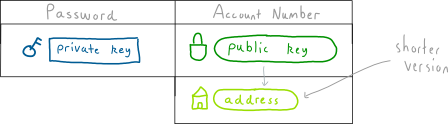

# Khóa và địa chỉ

Những con số duy nhất được sử dụng cho việc gửi và nhận các lô bitcoin

# Private Key ( Khóa bí mật ), Public Key ( Khóa công khai ) và Addresses ( Địa chỉ )

Để gửi và nhận tiền ở dạng bitcoin bạn cần một con số đinh danh tài khoản ( account number ) và mật khẩu ( password )

Trong bitcoin chúng được gọi là private key và public key. Hay nói cách khác public key chính là account number còn  private key tương ứng với password.

Có điều là account number là một con số dài một cách khủng khiếp, nên để cho dễ dùng hơn chúng ta tạo ra một phiên bản cô đọng hơn của nó ( *condensed *version ) là địa chỉ ( address ). Từ nay nói đến địa chỉ  chính là phiên bản rút gọn của public key.

Như vậy chúng ta đã hiểu về vai trò của private key, public key và address

> # Tóm tắt
>
> Public key chính là account number
>
> Địa chỉ cũng chính là account number nhưng nó là phiên bản rút gọn của public key và mọi người vẫn thường sử dụng khi gửi bitcoin
>
> Private key chính là password để ngăn chặn người khác gửi bitcoin đi từ địa chỉ của bạn

**Vậy các loại key ( public và private ) cũng như địa chỉ từ đâu mà ra?**

## Private Key

Tất cả đều bắt nguồn từ private key.  Nó là một con số được sinh ra một cách ngẫu nhiên ( randomly generated number )

Bởi vì đây là con số rất lớn nên máy tính thích làm việc với nó ở định dạng số thập lục phân ( Hexadecimal )

Cùng là một số nhưng khi biểu diễn nó dưới sạng thập lục phân thì sẽ có chiều dài ngắn hơn so với số thập phân vì nó sử dụng thêm các ký tự a,b,c,d,e,f

Và đây là 1 ví dụ về private key

**Private Key: **ef235aacf90d9f4aadd8c92e4b2562e1d9eb97f0df9ba3b508258739cb013db2

Private Key có thể là bất cứ con số nào nằm giữa 1 và 115792089237316195423570985008687907852837564279074904382605163141518161494337.

## Public Key

Hãy sử dụng private key của bạn để tạo ra public key

Trước tiên chúng ta hiểu là cái gì public thì mọi người đều sẽ nhìn thấy cả.  Do đó khi dùng private key để tạo public key chúng ta phải đảm bảo nguyên tắc rằng dù biết public key thì người khác cũng không thể tìm ra được private key là gì.

Điều đó sẽ đảm bảo rằng private key có thể bảo vệ được số bitcoin có trong ví của bạn

Chúng ta sử dụng một hàm toán học để tạo ra private key. Chúng ta chỉ cần nhét private key vào cái hàm đó và nó sẽ cho ra một public key.

Có 2 lợi ích khi sử dụng loại hàm toán học kiểu này

1．Hàm trả về public key có liên hệ toán học với private key. Điều này sẽ rất tiện dụng khi muốn thực hiện các giao dịch bitcoin

2\. Mặc dù public key có liên hệ, kết nối với private key nhưng người ta không thể tìm ra được private key từ public key vì đó là hàm toán học một chiều.

Vậy là nhờ vào 2 hàm số, hàm sinh số ngẫu nhiên và hàm này chúng ta sẽ có được 1 cặp private key và public key như sau

**Private Key:**ef235aacf90d9f4aadd8c92e4b2562e1d9eb97f0df9ba3b508258739cb013db2

**Public Key:**02b4632d08485ff1df2db55b9dafd23347d1c47a457072a1e87be26896549a8737\

Địa chỉ ( Address ): Như chúng ta thấy ở trên con số dùng public key được sinh ra quá là dài khiến ai cũng thấy oải khi gõ cả cái dòng kia nên chúng ta cần tạo ra một thứ dễ dùng hơn để sử dụng trong thực tế

Tất cả việc chúng ta cần làm là nén public key lại và sử dụng một định dạng không dùng bất cứ ký tự nào trông giống nhau khi được viết ra. Ví dụ "o" và "O",  "0" và "1".  Mặc dù đây không phải là sự thay đổi hoàn toàn khác biệt nhưng nó đã có sự cải tiến ( rút ngắn chiều dài ). Và do đó chúng ta có phiên bản ngắn gọn của public key

**Public Key:**02b4632d08485ff1df2db55b9dafd23347d1c47a457072a1e87be26896549a8737

**Address**: 1EUXSxuUVy2PC5enGXR1a3yxbEjNWMHuem

Và bởi vì public key cũng đã được nén nên chúng ta cũng không thể tìm ra được public key từ địa chỉ.

# Các bạn có nhất thiết phải nhớ cả 3 loại key này không?

Bởi vì address và public key được chế ra từ private key nên bạn có thể vứt chúng đi, không cần nhớ mà chỉ cần lưu giữ cẩn thận private key của mình thôi.

Và trong tình trạng xấu nhất khi mà bạn cần gửi địa chỉ ví của mình cho ai đó nhưng lại đánh mất nó ( không nhớ ) thì bạn chỉ cần dùng private key để tìm ra nó.

> Thực tế thì trong cuộc sống hàng ngày bạn sẽ phải thường xuyên chuyển và nhận cho ai đó một số bitcoin trong ví của mình nên tốt hơn hết bạn cứ lưu cả 2 loại private key và address cho nó tiện

**Điều gì xảy ra nếu bạn đánh mất private key?**

Nếu mất thì coi như bạn đi tong rồi, không thể tìm ra được private key từ những dữ liệu khác vì bản thân nó đã là dữ liệu gốc rồi. Mất thì đành chịu thôi.

Và tất nhiên nếu bạn không có private key thì số bitcoin trong địa chỉ ( ví ) của bạn sẽ sẽ bị khóa ( locked ) vĩnh viễn.

# Điều này có phải vì lý do an ninh?

Bạn có thể thấy đây là một hệ thống không thể tha thứ ( vì nó làm bạn không thể lấy lại số tiên của mình khi mất private key ) nhưng đó là cần thiết.  Hệ thống nó được thiết kế như vậy để đảm bảo rằng không có backdoor cho tiền của bạn, chỉ có một chìa khóa duy nhất để truy cập vào tiền của bạn, và bạn sẽ phải chịu trách nhiệm về nó.

