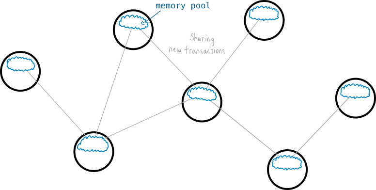
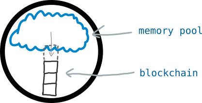
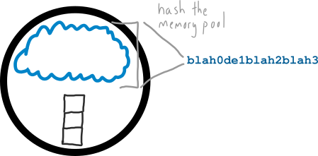
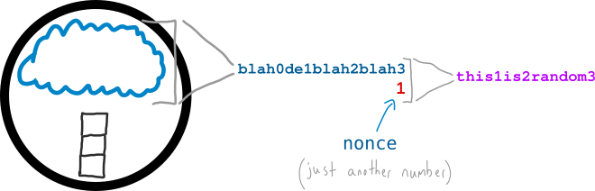
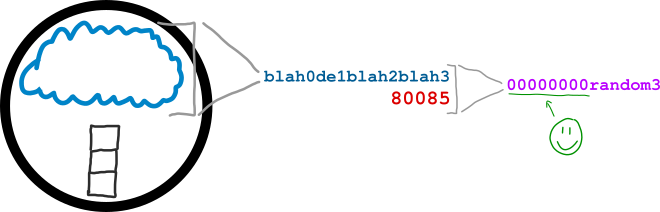
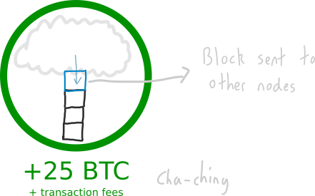
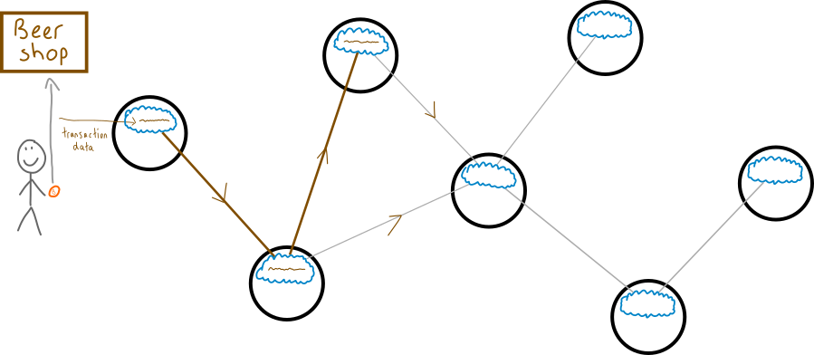
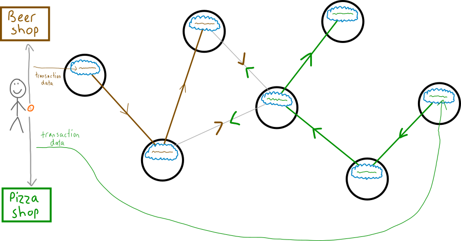
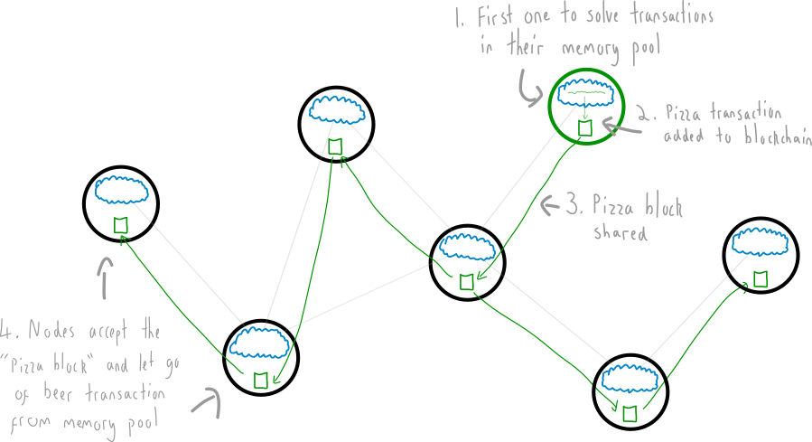
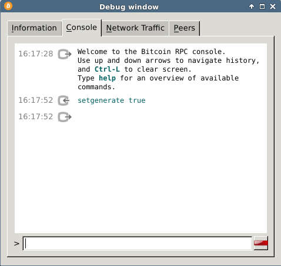

# Mining là gì?

#> Mining là quá trình thêm các transaction vào blockchain.

## Quá trình này hoạt động như thế nào?

Mọi Node trên Bitcoin Network sẽ đều share thông tin chung về các transaction mới. Chúng sẽ lưu trữ các transaction này trên MEMORY POOL của riêng mình. Dưới đây là hình dung về MEMORY POOL.

Mỗi Node cũng có tùy chọn ( option ) để thử và đào ( mine ) các giao dịch trên MEMORY POOL để đưa vào file chưa tất cả các transaction được xác nhận ( mine ) , file này chính là blockchain.

Để thêm được 1 transaction từ Memory Pool vào trong Blockchain thì Node sẽ tốn rất nhiều tài nguyên tính toán ( computer processing power ), và tất nhiên đi kèm với nó là việc tốn điện để chạy.

Việc tốn kèm này là bắt buộc, nó tạo ra thử thách cho các transaction trong  Memory Pool.

## Thử thách đó là gì?

Hãy tưởng tượng bạn là 1 Node, bạn có thể biến đổi các transaction thành một chuỗi các ký tự chữ và số.

Bây giờ mục tiêu của bạn là hash chuỗi ký tự này cùng với một con số để tạo ra một chuỗi ký tự mới bắt đầu bằng một số các chữ số 0.

Đầu tiên chúng ta chọn 1 số nonce đem hash với chuỗi loằng ngoằng ở trên để ra một chuỗi mới. Số nonce là gì sẽ được giải thích cụ thể trong bài Blocks sau.

Sau khi có chuỗi mới ta lại thay tiếp nonce bằng 1 số khác, thường là cứ theo thứ tự tăng dần 2, 3, 4.. cho đến khi tìm được số nonce cuối cùng giúp tạo ra chuỗi thỏa mãn điều kiện giải quyết được bài toán. Ở đây số nonce tìm được cuối cùng là 80085

Nhìn thì có vẻ dễ dàng nhưng thật ra đây là một bài toán khó, vì bạn tìm ra lời giải số ( tìm được số nonce thỏa mãn điều kiện ) chỉ bằng cách thử và sai. Và đó chính là lý do mà quá trình này được gọi là đào ( mining ) vì nó có khác gì việc đào vàng đâu, bạn phải cuốc đất và tìm quặng vàng lẫn trong đó, kết quả còn phụ thuộc và cả sự may mắn nữa, ăn may thì bạn tìm được vàng. Mỗi nhát cuốc mà bạn vung lên chính là một hành động hashsing. Đào vàng thì tốn sức còn hashing thì lại tốn tài nguyên tính toán của máy tính ( processing power ).

Nếu bạn may mắn tìm được kết quả đúng thì transaction của bạn từ memory pool sẽ đươc đẩy vào blockchain.  Các node khác trên node khác trên network cũng sẽ thêm block mà bạn đào được vào file blockchain của họ.

Bạn cũng sẽ nhận được 25BTC sẽ mỗi lần đào được block, và bạn cũng nhận được cả tiền phí hoa hồng cho các giao dịch mà bạn đã xác nhận.

> Một chú thích thêm lý do tại sao lại cần hash ra chuỗi bắt đầu bằng một số các chữ số 0. Nguyên do là Difficulity ( mức độ khó của việc đào ) . Mức độ khó này được quy định bởi Network, tùy theo số lượng các miner  ( người tham gia đào ).  Càng có nhiều người tham gia đào thì độ khó sẽ được tăng lên và số lượng chữ số 0 trong chuỗi kết quả hash ( hash result ) càng cần nhiều hơn.  Đây là chủ ý của Nakamoto Satoshi cha đẻ bitcoin tạo ra để ngăn cản việc có thể đào các block mới một cách dễ dàng.

> Đây là phiên bản đơn giản của mô tả làm thế nào một block được thêm vào blockchain. Để biết chi tiết hơn nữa thì xem bài Blocks

## Tại sao việc mining lại là cần thiết?

Tại sao chúng ta không add thẳng transaction luôn vào blockchain cho xong lại phải lằng nhằng tạo ra nhiều thử thách rắc rồi gây khó dễ cho việc đưa transaction vào blockchain?

> Bời vì quá trình đào ( mining-vượt qua thử thách ) chính là quá trình làm cho toàn bộ Bitcoin Network đồng thuận với nhau về transaction nào được đưa vào blockchain, nó ngăn chặn những gian lận trong việc trao đổi giao dịch tiền kỹ thuật số

Khi bạn tạo ra một giao dịch bitcoin thì các node trên mạng Bitcoin Network không thể nghe và biết về nó ngay lập tức. Thay vào đó transaction này sẽ được chuyển tới các node khác trong mạng bằng cách truyền từ node này sang node khác.

Tuy nhiên thì rất có  thể sẽ xảy ra trường hợp là tại một transaction khác cùng sử dụng một lượng bitcoin như transaction vừa rồi và transaction đó cũng được thêm vào blockchain.  Ví dụ bạn có thể dùng 1 bitcoin để mua bia và ngay sau đó cũng dùng 1 bitcoin đó để mua 1 piza ( đây là lúc coin còn rẻ thôi nhé còn giờ thì 1 coin mua được cả núi bia với pizza ). Đây chính là tình huống gian lận có thể xảy ra, vì cả 2 giao dịch đều được gửi đi để các node khác nhận, trong khi một số node chỉ biết về giao dịch mua bia, một số khác lại chỉ biết về giao dịch mua piza, rất có thể cả 2 giao dịch đều được xác nhận là hợp lệ.

Mặc dù là bạn thực hiện transaction mua piza sau transaction mua bia, nhưng do cách mà các transaction này được truyền đi trên mạng Bitcoin Network qua những con đường lòng vòng nên có sự không thống nhất trong việc xác nhận là bạn đã mua piza hay mua bia.

## Vậy làm thế nào để mạng Bitcoin Network quyết định transaction nào sẽ hợp lệ

Tất nhiên đó là thông qua cơ chế mining đã nói ở trên.

Nếu node nào vượt  qua được thử thách thì các transaction trong memory pool của nó sẽ được đưa vào blockchain

Có vẻ đây không hẳn là một cách làm chân chính để lựa chọn các transaction, về lý tưởng thì phải là transaction nào được tạo ra trước thì sẽ được chọn, tuy nhiên chúng ta không có giải pháp để đáp ứng được điều đó. Đây là cách tối ưu để mạng Bitcoin Network tạo ra sự đồng thuận trong việc xử lý các thông tin có xung đột, mâu thuẫn với nhau.

> Ở khía cạnh tích cực thì chỉ mất 10 phút để thêm mới một block ( chứa các transaction ) vào blockchain. Như vậy bạn cũng chỉ cần chờ 10 phút để biết rằng giao dịch của bạn đã được thực hiện hay chưa ( bitcoin mà bạn chi ra để mua bia đã được chuyển đến địa chỉ mới của anh bán bia, và không được chuyển đến địa chỉ của chị bán piza )

## Một lợi ích khác của việc mining

Nếu bạn muốn thử kiểm soát một các block ( hay các transaction ) để có thể add được nó vào blockchain thì các bạn phải cạnh tranh với các node khác trong mạng để vượt qua thử thách ( cụ thể ở đây là bài toán số học tìm số nonce bằng các phép tính hashing )  trở thành người chiến thắng và block mà bạn đào được sẽ được lựa chọn.

Nói các khác bạn cần có một máy tính cấu hình mạnh đủ năng lực tính toán để giải quyết các bài toán ( thử thách ) mà mạng đưa ra. Nếu bạn có hàng tỉ đô để dành ra để chi phí cho các phần cứng đắt tiền như các máy đào coin thì bạn có thể control được network.

### Khi nào thì bạn có thể bắt đầu đào coin?

Chăc hẳn bạn cũng muốn kiếm được phần thưởng 25 BTC chứ?

Để đào coin bạn chỉ cần bật công tắc ( một cái nút bấm ) trên Bitcoin Client

Sự thật là đào coin bằng loại CPU trên máy laptop của bạn sẽ chẳng ăn thua gì đâu, cần máy đào chuyên dụng. Tuy nhiên nếu bạn chưa tin và vẫn muốn chiến thì cứ thử.

Bạn cũng có thể điều Bitcoin Client bằng dòng lệnh.

Vào Help > Debug Window > Console

Và gõ lệnh sau:

`setgenerate true`

Lệnh này sẽ bật chế độ đào lên.

Chương trình Bitcoin Client trên  máy của bạn sẽ sinh ra một block các transaction trong memory pool và bắt đầu hashing chúng. Bạn sẽ nhận ra ngay máy của mình đang cày cuốc để đào vì bộ vi xử lý sẽ bắt đầu rít lên. Nhưng dù rít lên thì nó cũng sẽ không đào được block nào đâu trừ khi phép lạ xảy ra. Nhưng làm thử để biết cho vui thì được. Muốn đào coin thật thì đi mua trâu về đào nhá.

Muốn tắt chế độ đào đi thì gõ lệnh sau:

`setgenerate false`

