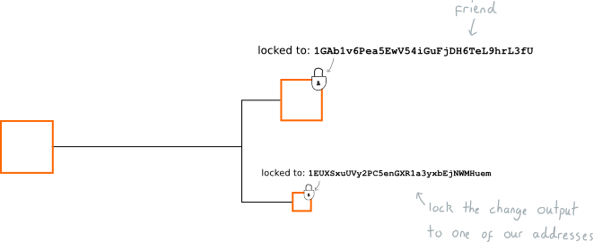

Output Locks

Cơ chế khóa ( locking ) cho các lô bitcoin

# Output locks là gì?

Một output lock là một tập các yêu cầu được đặt trong output. Chỉ khi các yêu cầu này được thỏa mãn thì chúng ta mới có thể sử dụng được output trong các giao dịch

Ví dụ một output lock thông thường sẽ có dạng như sau:

output này bị khóa đối với địa chỉ trên nên bạn cần có private key để mở khóa ( unlock ) cho nó.  Các khóa này ngăn chặn việc chúng ta dùng các output của người khác trong giao dịch. Mỗi một output chúng ta nhận được đều bị khóa.

# Các output lock từ đâu mà ra?

Như chúng ta đã biết, giao dịch là quá trình tạo ra các output từ các output sẵn có

Và trong quá trình tạo ra các output này thì chúng ta gán cho mỗi output một khóa ( lock )

Khi chúng ta gửi đi một số bitcoin cho bạn của mình chúng ta tạo ra những output mới và chúng ta cho thêm khóa vào  output này và quy định rằng chỉ có người sở hữu địa chỉ `1friend1234567890 mới có thể sử dụng output này.`

Kết quả là outuput đó thuộc về bạn của chúng ta bởi vì họ là người duy nhất có private key cho địa chỉ đó, không người nào khác có thể sử dụng chúng

Cần phải chú ý rằng thực tế thì bạn không hề "gửi" đi bitcoin nào trong giao dịch. Thay vào đó bạn tạo ra các giao dịch bằng cách tạo ra các output ( đi kèm với các lock ) và gửi các thông tin về giao dịch này trên bitcoin network và đợi cho đến khi nó được mine vào blockchain

Mặc dù blockchain là một file các giao dịch nhưng ở mức độ thực tế hơn bạn có thể xem nó là một đơn vị lưu trữ các output.

Khi bạn gửi bitcoin cho ai đó đơn giản là bạn tham chiếu tới output trên blockchain mà bạn đã mở khóa ( unlock ) nó.

Và khi block được mine vào blockchain thì các output mà bạn đã sử dụng ( với vai trò là inputs ) sẽ không thể sử dụng lại được nữa.

Như thế blockchain lưu trữ toàn bộ các output và bạn có thể sử dụng bất cứ cái nào trong số chúng vào bất cứ thời điểm nào miễn là bạn có thể unlock chúng

# Làm thế nào để tạo ra một output lock?

Output lock được viết bằng một ngôn ngữ lập trình cơ bản gọi là SCRIPT. Tuy là rất khó để có thể diễn tả toàn bộ một ngôn ngữ lập trình trong một lược đồ đơn giản nhưng chú ta cứ cố gắng hình dung ra nó

Lock mà chúng ta vừa lập trình gọi là LOCKING SCRIPT

Phần thú vị nhất của locking script là **`CHECKPRIVATEKEY`**

đây là một hàm chúng ta sử dụng để thiết lập điều kiện cho lock. Do đó với từng lock cụ thể  chúng ta sẽ thiết lập lock muốn so sánh với địa chỉ `1EUXSxuUVy2PC5enGXR1a3yxbEjNWMHuem`

gắn với một private key. Nếu chúng ta có thể cung cấp một lock khớp với private key chúng ta có thể unlock chúng và sử dụng trong transaction

# Làm thế nào để unlock một output lock?

Khi chúng ta xây dựng dữ liệu cho giao dịch chúng ta sẽ nhúng một locking script vào mỗi output mà chúng ta định sử dụng.

Với ví dụ này, để unlock một locking script điển hình ví dụ dạng `[address][CHECKPRIVATEKEY]`) chúng ta cần phải chứng minh chúng ta sở hữu địa chỉ `[address].` Để làm điều đó thì chúng ta cần sử dụng private key để tạo chữ ký số

Bạn cần cho chữ ký số vào trong locking script

Khi một node nhận được dữ liệu giao dịch chúng sẽ chạy các script locking và unlocking cùng nhau và nếu thấy chữ ký số của bạn khớp với địa chỉ mà output đã khóa vào 

Nếu mọi thứ ngon lành node sẽ chấp nhận giao dịch và chuyển nó cho một node khác và node này lại tiếp tục quay trở lại chạy locking \+ unlocking script trước khi chấp nhận giao dịch. Và đó là cách bạn unlock một output lock.

# Chúng ta đang tự đánh private key của mình ?

> Thực ra thì chúng ta không trực tiếp nhét private key vào dữ liệu giao dịch

Như các bạn thấy, để tự cứu mình khỏi việc đánh mất private key trong các dữ liệu giao dịch, chúng ta tạo ra một thứ gọi là chữ ký số

Hàm so sánh giữa một \[address\] với \[digitalsignature\] gọi là hàm CHECKSIG

Nhờ chữ ký số và hàm CHECKSIG chúng ta có thể khóa output vào các địa chỉ và có thể unlock chúng mà không sợ đánh mất private key của mình.
