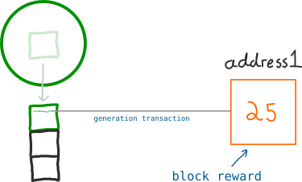
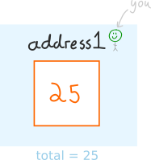
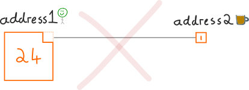
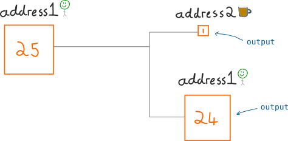
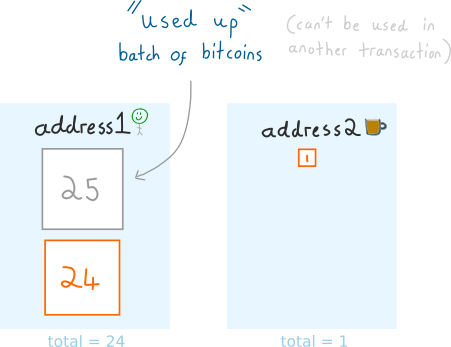
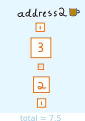
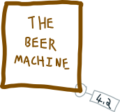
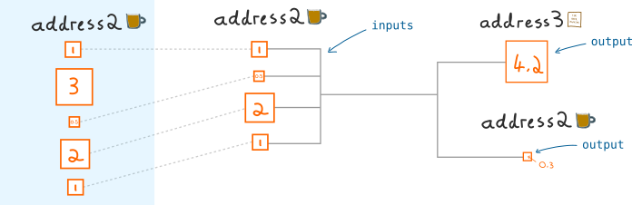
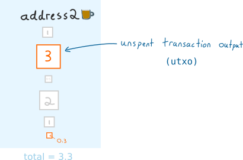
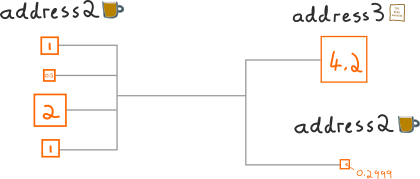

Outputs

Là những lô ( batch ) bitcoin mới được tạo ra trong các giao dịch ( transaction )

> Hệ thống giao dịch bitcoin liên quan đến việc gửi và nhận một lô những bitcoin được gọi là OUTPUTS

Định nghĩa là như vậy nhưng có lẽ nó vẫn còn hơi mô hồ cho nên để thực sự hiểu nó hoạt động như thế nào thì cách tốt nhất là nhìn vào ví dụ cụ thể

# Giao dịch số 1- Một giao dịch đơn giản

Chúng ta cùng bắt đầu với câu chuyện với việc sinh ra một lô các bitcoin mới tinh.

Giả sử bạn đang đào coin, và nhờ phép lạ nào đó mà bạn đào được 1 block và kiếm được 25 bitcoin tiền thưởng do đào được block này

Mỗi miner cũng đặt địa chỉ của mình trên top của mỗi block nếu bạn đào được 1 block thì tiền thưởng ( BLOCK REWARD ) sẽ được chuyển đến tài khoản của bạn.

Đây là trạng thái tài khoản tại địa chỉ của bạn

Có tiền về thì tất nhiên là phải chúc mừng rồi. Chúng ta cùng uống bia nhé

Nhưng để có bia thì phải xì tiền ra mua. Bạn sẽ lấy ra 1 bitcoin trong số tiền vừa rồi để mua bia nhé. Có vẻ bắt đầu hiểu, nhưng đây vẫn không phải là cách mà các giao dịch ( transaction ) hoạt động

Thực tế sẽ không phải như thế này

Thay vào đó chúng ta sẽ phải gửi theo lô toàn bộ 25 bitcoin trong giao dịch

Nhưng cần nhớ rõ là chúng ta sẽ không tiêu cả 25 bitcoin cho việc thanh toán một đơn hàng có giá trị 1 bitcoin.  Chúng ta phải tách lô bitcoin này và gửi đến 2 đích khác nhau

1. Cửa hàng bia ( thanh toán )

2. Gửi lại cho chính địa chỉ của mình ( tiền thừa được trả lại )

Một số lô ( batch ) mới được tạo ra gọi là Outputs

Có vẻ như là một cách làm rất lòng vòng nhưng nó cho cùng một kết quả so với cách nghĩ ban đầu

> Tại sao các giao dịch lại hoạt động theo cách này? Bởi vì nó đơn giản và an toàn hơn nếu nhìn từ khía cạnh lập trình

Đây là hình ảnh của các địa chỉ sau giao dịch

Cửa hàng bia có 1 batch 1 bitcoin còn chúng ta vừa tự gửi cho mình 1 batch 24 bitcoin còn lô 25 bitcoin ban đầu được chuyển sang trạng thái "sử dụng hết".

Việc này sẽ tương đương với việc chúng ta lấy 1 bitcoin từ địa chỉ của mình và gửi cho người khác lúc đầu nhưng chúng ta đã hiểu được cơ chế bên trong

**Tóm tắt**

Đây là cách mà hệ thống giao dịch bitcoin được thiết kế

1. Lấy ra ouput ( lô các bitcoin ) có sẵn

2. Tạo ra một ouput mới có kích thước mới từ output có sẵn ở trên

3. Gửi các output đến các địa chỉ khác nhau

# Giao dịch số 2- Sử dụng ouput với tư cách là input ( đầu vào )

Từ giờ trở đi chúng ta sẽ sử dụng từ Ouput thay cho Batch ( lô ).

Chúng ta hãy quay lại với cái quán đã bán bia cho chúng ta, nhìn vào địa chỉ bitcoin của quán này thì có vẻ là họ làm ăn rất phát đạt.

Tuy nhiên chúng ta biết là bia thì không tự mọc ra từ trên cây nên các quán bia đều phải cần đến máy làm bia.

Oh, có một cái máy làm bia giá có vẻ hời khoảng 4.2 bitcoin. Mua nó về thôi

Chắc bạn đang thắc mắc về hình vẽ ở trên. Hơi khó giải thích 1 chút.

1. Quán bia không có output đơn lẻ tại địa chỉ của mình để trả cho số lẻ 4.2 bitcoin nên nó sẽ tập hợp 1 nắm các outputs với nhau để có tổng số lớn hơn 4.2 bitcoin

2. Khi tạo một giao dịch thì các output mà chúng ta vừa gom lại với nhau để trả tiền sẽ được sử dụng như là một Input cho một giao dịch. Khi chúng ta sử dụng output trong một giao dịch với vai trò trung gian tạm thời thì nó được gọi là input.

3. Sử dụng tổng số Input là 4.5 bitcoin thì cửa hàng bia tạo ra 2 output mới là 4.2 và 0.3

Và đây là trạng thái của địa chỉ bitcoin của quán bia

Một lần nữa Output lại được sử dụng như là Input và "tiêu hết", sau đó chúng sẽ không được sử dụng lại lần nữa.

Phần output chưa tiêu thì chúng ta vẫn có thể tiếp tục sử dụng. Chúng ta gọi chúng là *unspent transaction outputs*([UTXO](http://learnmeabitcoin.com/glossary/utxo)s)

> Tổng số bitcoin tại một địa chỉ sẽ bằng tổng số các output chưa tiêu hết UTXO

Chúng ta chọn các output `[1] + [0.5] + [2] + [1] `để làm input  cho giao dịch. Miễn là tổng sổ các output này lớn hơn số lượng bitcoin mà chúng ta muốn gửi đi chúng ta có thể sử dụng bất cứ tổ hợp các output (well, *inputs*) nào mà chúng ta muốn.

`[1] + [3] + [0.5]             = 4.5`
`[3] + [2]                     = 5`
`[1] + [3] + [0.5] + [2] + [1] = 7.5`

Tất cả cách cách tổ hợp ouput này với nhau để tạo ra input đều ok cả, giống như bạn có thể dùng các đồng 10 nghìn, 20 nghìn hay 50 nghìn để mua gói tăm. Khác nhau chỉ là tiền thừa trả lại trong mỗi tình huống thôi.

Giao dịch số 3- Phí giao dịch

Nhìn lại các giao dịch ở trên, các bạn hãy để ý là chúng ta đã không đề cập đến phí giao dịch. Nếu không trả phí giao dịch thì các giao dịch mà bạn tạo ra lúc nãy sẽ phải chờ một lúc lâu bởi vì Bitcoin là hệ thống có phí giao dịch, nếu bạn chịu trả phí thì giao dịch của bạn sẽ giành được quyền ưu tiên xử lý trước.

> Phí giao dịch sẽ hấp dẫn các miner chọn giao dịch của bạn đưa vào xử lý,  và khi họ đào block mới, giao dịch của bạn sẽ được add vào block mà họ đào.

Giả sử chúng ta không gửi transaction cuối cùng lên mạng bitcoin network và thêm phí giao dịch cho nó

Nếu vậy thì Output cho phí giao dịch sẽ là gì ? Hãy nhìn vào kích thước của output
