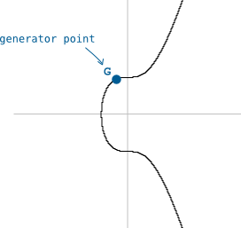

# Public Key

Một số duy nhất sinh ra từ private key

# Public Key là gì?

Nó chính là dạng nguyên thủy của một địa chỉ tài khoản bitcoin.

Giống như private key, nó là một con số và thường được biểu diễn dưới dạng số thập lục phân.

Ví dụ

> public_key  = 02b4632d08485ff1df2db55b9dafd23347d1c47a457072a1e87be26896549a8737

Và điểm thú vị nhất chính là public key của bạn được tạo ra từ private key. Nếu như bạn không tiếp tục nén public key lại thành dạng ngắn hơn là address thì bạn hoàn toàn có thể dùng nó luôn làm địa chỉ tài khoản và có thể gửi và nhận bitcoin từ tài khoản này.

# Làm thế nào có thể lấy được public key từ private key?

Bạn cần nhét private key vào một hàm toán học đặc biệt và nó sẽ trả lại cho bạn public key

# Hàm đó là hàm gì vậy?

Hàm đó được gọi là phép nhân elip nó có  dạng mô tả hình học giống như đồ thị cong như hình dưới đây

Chúng ta bắt đầu với 1 điểm G nằm trên đường cong này. Và nếu chúng ta sử dụng 1 phép nhân trên đường cong này.  Ví dụ nhân G với 2 thì kết quả của phép toán này sẽ tương ứng với di chuyển hình học mô tả bằng hình dưới đây theo thứ tự sau.

1\. Vẽ một tiếp tuyến tại điểm G

2\. Chọn điểm giao cắt giữa tiếp tuyến này với đồ thị ( điểm số 2 )

3\.  Lấy giá trị nghịch đảo của điểm số  trên ( đối xứng qua trục hoành )

Thực tế là chúng ta có thể vẽ một tiếp tuyến ở bất cứ đâu, và nó có thể giao với đồ thị tại một điểm khác.

Và bây giờ chúng ta có điểm 2G là đầu ra cho phép biến đổi.  Ta quá trình biến đổi vừa rồi là "phép nhân đường cong elip".  Từ giờ trở đi khi nói đến "phép nhân" chúng ta sẽ hiểu nó là "phép nhân đường cong elip" thay vì phép nhân toán học thông thường mà chúng ta vẫn thấy. Bằng cách "nhân" điểm G với 2 tà có điểm 2G như trên đồ thị.

# Làm thế nào để chúng ta có được public key?

Ở ví dụ trên chúng ta nhân điểm G với 2 và thu được 2G

Để lấy được public key thì chúng ta nhân G với private key

> Ví dụ\
> \
> private_key = ef235aacf90d9f4aadd8c92e4b2562e1d9eb97f0df9ba3b508258739cb013db2
> private_key = 108165236279178312660610114131826512483935470542850824183737259708197206310322
> 
> public_key  = 108165236279178312660610114131826512483935470542850824183737259708197206310322 \* G

Các bạn để ý thấy nếu chúng ta hình dung điểm G như quả bóng bàn thì chuyển động của nó giống như quả bóng bàn nảy qua nảy lại xung quanh trục hoành. Và khi nhân G với 2 thì số lần "bóng nảy" sẽ là 2

Khi thay 2 bằng private key thì chúng ta sẽ có một chuyển động phức tạp hơn thế rất nhiều, cụ thể số lần "bóng nảy" ở đây sẽ là bằng private key.

Điểm cuối cùng trên đường cong mà chúng ta thu được sẽ cung cấp cho chúng ta một cặp tọa độ 

Ví dụ

> x = 81591541406288143274758265124625798440200740391102527151086648448953253267255
> y = 64573953342291915951744135406509773051817879333910826118626860448948679381492

Thao tác tiếp theo là chúng ta chuyển đổi các tọa độ này sang dạng thập lục phân

> public_key (x) = b4632d08485ff1df2db55b9dafd23347d1c47a457072a1e87be26896549a8737
> public_key (y) = 8ec38ff91d43e8c2092ebda601780485263da089465619e0358a5c1be7ac91f4
> 
> public_key (x,y) = b4632d08485ff1df2db55b9dafd23347d1c47a457072a1e87be26896549a87378ec38ff91d43e8c2092ebda601780485263da089465619e0358a5c1be7ac91f4

Đây là dạng ban đầu của của public key, có nghĩa là chúng ta phải đặt thêm số 04 vào đầu của nó, như dưới đây

`public_key = 04b4632d08485ff1df2db55b9dafd23347d1c47a457072a1e87be26896549a87378ec38ff91d43e8c2092ebda601780485263da089465619e0358a5c1be7ac91f4`

Để hiểu lý do tại sao lại như vậy chúng ta cần đọc phần nén public key ở dưới

Để tiết kiệm không gian thì các public key chỉ sử dụng trục tọa độ x

Bởi vì đường cong elip này là một phương trình y^2 =x^3\+7. Điều đó có nghĩa là nếu bạn có tọa độ x thì bạn có thể tìm ra tọa độ y tương ứng. Tuy nhiên thì đối y^2 là một vế của phương trình thì y có thể có giá trị âm hoặc giá trị dương

Vì vậy thông tin bổ sung duy nhất mà chúng ta cần tìm tọa độ y chính xác là cần biết tọa độ y ở trên hay ở dưới trục x

* Nếu y chẵn nó nằm trên trục x

* Nếu y lẻ nó nằm dưới trục x 

Do đó thay vì lưu trữ cả 2 giá trị x và y như là public key thì chúng ta chỉ cần lưu trữ giá trị x dù y là số chẵn hay lẻ.

Trong bitcoin, phần chẵn hoặc lẻ được hiển thị bằng cách thêm một số vào tọa độ x.

* chẵn =02

* lẻ=03

Như vậy thì dạng ban đầu của public key được đánh dấu bằng số 04 ở đầu, còn dạng nén của public key thì được đánh dấu bằng số 02 hoặc 03

Ví dụ

`public_key            = 04b4632d08485ff1df2db55b9dafd23347d1c47a457072a1e87be26896549a87378ec38ff91d43e8c2092ebda601780485263da089465619e0358a5c1be7ac91f4
public_key_compressed = 02b4632d08485ff1df2db55b9dafd23347d1c47a457072a1e87be26896549a8737`

Chúng ta thấy rằng có rất nhiều nỗ lực để làm giảm bớt số lượng text  đó là bởi vì  khóa công khai public key được dùng trong các transaction nên nó sẽ tiết kiệm được rất nhiều bộ nhớ trên blockchain

# Tại sao chúng ta dùng phép nhân đường cong elip để tạo ra public key?

Bởi vì các đường cong elip có 2 thuộc tính rất hữu ích khi tạo ra cặp khóa private/public key

1\. Phép nhân đường cong là một "hàm bẫy" ( trapdoor function ). Nói cách khác, bạn không thể truy hồi ngược lại ( phân chia cách tọa độ của public key ) để tìm ra được private key.

> Hàm bẫy là một hàm dễ tính theo một hướng, nhưng khó tính theo hướng ngược lại (tìm nghịch đảo của nó) mà không có thông tin đặc biệt, được gọi là cửa bẫy (trapdoor) tức là loại cửa có lối vào nhưng không có lối ra.

2\. Public key có liên kết toán học với private key nên với tư cách là một kết quả, nó có thể chứng minh được mối liên hệ, kết nối này với private key mà không cần phải công khai private key.

Do đó  nếu bạn đưa cho tôi 1 public key ( hoặc địa chỉ tài khoản ) thì bạn có thể chứng minh được rằng bạn sở hữu nó mà không cần cho tôi xem private key

Khả năng này đặc biệt tiện dụng khi bạn muốn thực hiện giao dịch bitcoin, bao gồm việc đưa public key của bạn vào dữ liệu giao dịch và chứng minh rằng bạn là chủ sở hữu của nó, mà không phải đưa private key của mình vào dữ liệu giao dịch.

Public key là một số duy nhất được tạo từ private key. Vì vậy, khi bạn nói rằng bạn sở hữu một public key, có nghĩa là bạn biết số private key mà public key được tạo ra từ nó.

# Làm thế nào để bạn chứng minh bản sở hữu public key?

Như đã nói có một liên kết toán học giữa private key và public key của bạn

Kết quả là

1\. Bạn có thể đặt private key của mình vào một phép biến đổi toán học dạng đường cong elip để tạo được một giá trị mới

2\.Bạn có thể đặt private key của mình vào một phép biến đổi toán học dạng đường cong elip để tạo được một giá trị mới khác

Sẽ có một sự chồng khớp nhỏ giữa các giá trị này

Giá trị mới mà bạn tạo ra từ private key mới của mình gọi là chữ ký số ( digital signature )

### Và sự chồng khớp này chứng minh liên kết toán học giữa private key và public key.

Và bởi vì không ai có thể tạo ra được chữ ký số mà không biết private key nên chữ ký số của bạn đủ để chứng minh rằng bạn sở hữu public key ( tức là tài khoản bitcoin ) và như thế bạn có thể chứng minh với mọi người bạn sở hữu public key bằng chữ ký số của mình mà không cần show cho ai xem private key cả.
