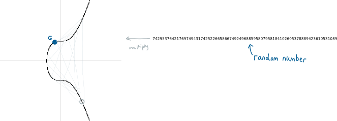
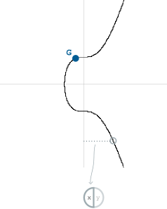
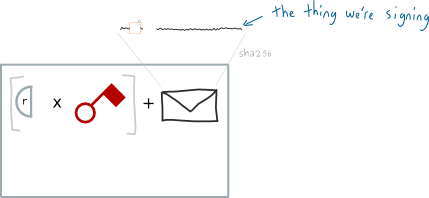
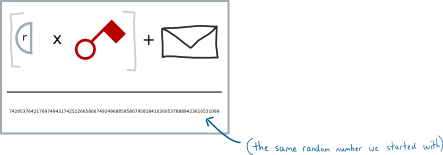
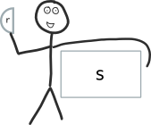
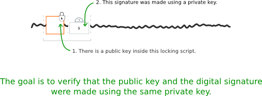
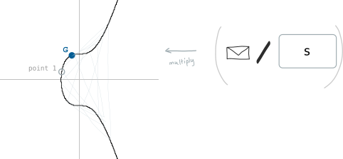
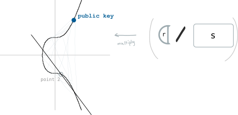
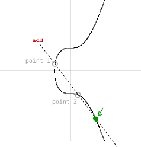
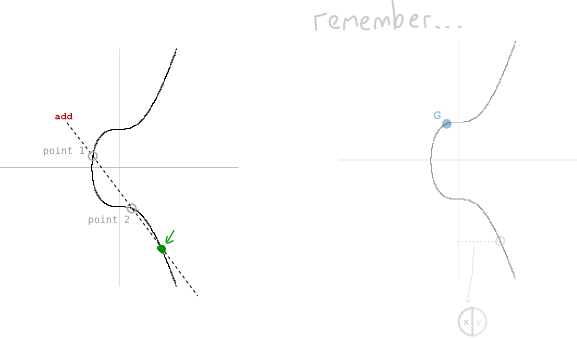

#                          Chữ ký số ( Ký và xác nhận )

Chứng minh rằng chữ ký số và public key được tạo ra từ cùng một private key

# Ký ( Signing )

Một chữ ký số có 2 phần

1. Phần ngẫu nhiên

2. Phần chữ ký ( private key\+ dữ liệu của transaction chúng ta dùng để tạo chữ ký )

# Phần ngẫu nhiên

Bắt đầu bằng việc sinh ra một số ngẫu nhiên. Sau đó nhân nó với điểm G ( generator point ) trên đường cong elip, điểm này trùng với điểm G đã trình bày trong bài public key.

Phần ngẫu nhiên của chữ ký số là sẽ là tọa độ x của điểm trên đường cong mà chúng ta kết thúc.

Và để ngắn gọn thì chúng ta gọi nó là "r" ( viết tắt của chữ random )

Về cơ bản thì nó giống như cách chúng ta tạo private key và public key nhưng chúng ta đưa thêm một phần ngẫu nhiên vào để tạo ra chữ ký số.

Bây giờ một nửa chữ ký số của chúng ta đã sẵn sàng, nhưng từ nãy đến giờ chúng ta vẫn chưa dùng đến private key một tí nào cả nên tất nhiên bây giờ chúng ta sẽ đề cập đến nó trong phần còn lại của chữ ký số

# Phần chữ ký

Đầu tiên chúng ta lấy private key, đem nhân nó với r ( tọa độ x của điểm sinh ngẫu nhiên trên đường cong elip đã nói ở trên )

Tiếp theo chúng ta đưa vào thông tin vê thứ mà chúng ta muốn ký, thông tin đó được gọi là message. Trong bitcoin thì message là giá trị hash của toàn bộ transaction có chứa các output mà chúng ta muốn unlock

Nhồi giá trị hash của của chữ ký vào transaction và nó sẽ không thể được sử dụng trong transaction khác.

Cuối cùng để cho dễ cân đo thì chúng ta chia toàn bộ các giá trị này cho giá bị ngẫu nhiên ban đầu

Như vậy là chúng ta đã có "chữ ký" phần quan trọng của chữ ký số. Chúng ta sẽ gọi là s cho ngắn gọn ( s là viết tắt của signature)

Ngài chữ ký Mr. Signature

Nếu bây giờ có ai đó yêu cầu chúng ta chứng minh rằng chúng ta biết private key chúng ta sẽ đưa cho họ chữ ký số của chúng ta ( cấu thành từ r và s ) . Nhưng làm thế nào để người ta có thể dùng cái này làm bằng chứng?

# Xác nhận ( Verifying ) 

Trong bitcoin thì toàn bộ chữ ký này sẽ được gửi tới tập lệnh mở khóa ( unlocking script ) trong transaction. Private key mà chúng ta dùng để tạo chữ ký được kết nối ( connect ) với địa chỉ mà output đó bị khóa

Để xác minh rằng được tạo ra từ việc sử dụng đúng private key, người đưa ra chữ ký số cần sử dụng cả 2 phần để tìm những điểm mới trên đường cong elip

# Điểm 1

Chia message cho s. Điểm đầu tiên chính là điểm G ( generator point ) nhân với giá trị này  ( kết quả của phép chia )

# Điểm 2

Chia r cho s. Điểm 2 chính là public key nhân với giá trị này ( kết quả của phép chia )

Cuối cùng thì nếu chúng ta cộng 2 điểm này với nhau chúng ta sẽ tạo ra một điểm mới trên đường cong

Nếu tọa độ x của điểm thứ 3 bằng tọa độ x của điểm ngẫu nhiên mà chúng ta tạo ra lúc đầu với r thì đó chính là bằng chứng ra chữ ký số được tạo ra từ private key có kết nối với public key

  
