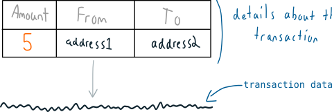
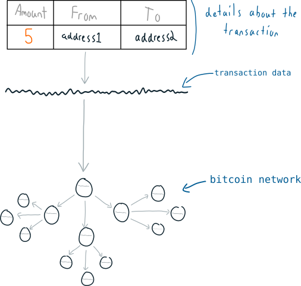
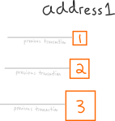

# Transactions

Là chọn những lô bitcoin và tạo ra những lô mới từ chúng

# Bitcoin transaction là gì?

Bitcoin transaction là một bó dữ liệu.

Dữ liệu này chứa các thông tin số lượng bitcoin được gửi đi, địa chỉ account gửi bitcoin đi cũng như địa chỉ account được gửi đến.

Đây là những thông tin đơn giản nên hoàn toàn có thể biểu diễn bằng 1 dòng

Khi bạn tạo một transaction tức là bạn đang gửi dữ liệu transaction qua mạng Bitcoin network

Cuối cùng thì một trong các nodes trong mạng sẽ mine ( đào ) transaction của bạn vào block và block này sẽ được thêm vào file các transaction sẽ được xác nhận ( tức là blockchain )

Đó là tất cả những gì về transaction.  Đơn giản nó chỉ là một dòng dữ liệu được đẩy lên mạng bitcoin network và chờ đợi được mine vào blockchain

# Bitcoin Transaction hoạt động như thế nào?

Trước tiên cần có một địa chỉ bitcoin là một con số đại diện cho tài khoản bitcoin、ｍỗi tài khoản sẽ nắm giữ một lượng bitcoin nhất định.

Tuy nhiên khi bạn tạo ra một transaction thì nó sẽ không giống như lấy một lượng coin từ tài khoản này đổ vào tài khoản khác

Thay vào đó sẽ là mỗi địa chỉ tự theo dõi những giao dịch riêng lẽ mà nó nhận được

H6

Khi bạn muốn gửi 1 số bitcoin cho người khác, bạn sẽ lấy toàn bộ số tiền ( bitcoin ) mà bạn nhận được và dùng chúng để gửi một số tiền mới đến một địa chỉ mới.

H7

Và khi ai đó muốn gửi tiền cho một người khác họ cũng dùng toàn bộ số bitcoin mà họ nhận được theo cách tương tự

Như vậy trong thực tế bạn sẽ Nhận được bitcoin theo lô ( batches ) và bạn sẽ sử dụng các lô này để tạo ra các lô mới rồi gửi đi cho người khác. Bạn có thể hình dung việc này giống như bạn gom các đồng tiền lẻ do người khác gửi cho mình, gộp vài đồng lại với nhau thành một số tiền to hơn rồi lại gửi chỗ tiền ( tập hợp từ các đồng tiền lẻ ) đó đi cho người khác. Đó chính là cách mà các transaction hoạt động.

H8

# Chờ một chút....

Chuyện gì sẽ xảy ra nếu tổng số lô ( batches ) mà bạn nhận được lại lớn hơn số tiền mà bạn muốn gửi đi thì sao?

Dưới đây là một tình huống ( mà những tình huống như thế này thì lại thường xuyên hay xảy ra trong thực tế. Khi đó bạn chỉ cần thêm 1 output nữa vào transaction và gửi phần sai biệt lại cho chính mìn

H9

Xem ra có vẻ rắc rối, nhưng đó chính xác lại là cách mà nó hoạt động từ quan điểm lập trình. Vì thế hãy quen với nó.

# Tóm tắt

1. Bạn có 1 địa chỉ bitcoin. Bitcoin sẽ được gửi đến địa chỉ này theo lô gọi là các output ( outputs ).

2. Bitcoin transaction là quá trình xử lý các output này để tạo ra các output mới và gửi chúng tới các địa chỉ mới.

3. Tất các transaction đều được biểu diễn bởi 1 dòng dữ liệu duy nhất.

H10

Để hiểu rõ hệ thống các outputs hoạt động thế nào hãy đọc chi tiết trong bài Outputs

# Cái gì ngăn chặn người khác tiêu mất bitcoin của bạn?

Nếu tạo ra một giao dịch chỉ đơn giản là sinh ra một dòng dữ liệu rồi đẩy lên mạng bitcoin thì tại sao không thể xảy ra tình huống một người tạo ra một giao dịch trong đó địa chỉ gửi tiền là địa chỉ của bạn còn địa chỉ nhận tiền là địa chỉ của họ để chiếm đoạt bitcoin có trong địa chỉ của bạn?

Trả lời: Bởi vì mỗi transaction output có 1 cái khóa...

H11

Nếu bạn tạo ra một transaction mới mà không mở khóa các output thì mạng bitcoin network sẽ  reject ( từ chối ) transaction đó.

H12

May mắn cho bạn là địa chỉ bitcoin của bạn có 1 private key

H13

Nếu bạn muốn gửi bitcoin đi đâu đó thì bạn phải dùng private key này để mở khóa các output đặt tại địa chỉ của mình

H14

Sau khi mở khóa các output mà bạn muốn sử dụng thì transaction sẽ được chấp nhận và lan truyền đi bởi các node trong bitcoin network

H14

Và đó là cách mà các transaction của bitcoin hoạt động.
